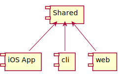

# Client with multiple front ends sample

This repo demonstrates how you can build multiple fronts ends using a shared Swift component with clean boundaries.

The example chosen is a networking client that fetches a list of people from [jsonplaceholder.typicode.com][1].
The networking client is then reused in 3 separate projects:

- An [iOS application](app) that displays the data in a table view.
- A [CLI](cli) that pretty prints debug information about the interaction with the client.
- A [Vapor application](web) that shows the same information as the CLI but in a slightly prettier format.

There are many interesting reuse opportunities but this repo concentrates on building supplementary debugging tools for the "production" iOS application.

---

The high level structure of the project is:



For details on the [iOS Application](app), the [CLI](cli) or the [Vapor Application](web) follow these links.

Each project roughly follows 3 steps - fetching data, preparing the data and then displaying it:

|         |           iOS           |          CLI         |          Web         |
|:-------:|:-----------------------:|:--------------------:|:--------------------:|
|   fetch |     Client.fetch(_:)    |   Client.fetch(_:)   |   Client.fetch(_:)   |
| prepare |    Store in variable    | Generate pretty JSON | Convert to ViewModel |
| present | `UITableViewDataSource` |   `print` to stdout  |      Render HTML     |

---

## Shared

The shared component has the following types:

``` swift
protocol JSONPlaceholderClient
```

Used to represent a type that can fetch `struct Person` instances from [jsonplaceholder.typicode.com][1].

To create these `Person` instances  there are some helpers defined like this:

``` swift
struct FailableDecodable<T>
```

A type that allows decoding of objects to fail without causing the entire decode to fail.

The failable decoding process works with

``` swift
enum Decoded<T>
```

To provide either the parsed data ready for production use or the parsed data, the raw data and any errors encountered by `FailableDecodable`.

---

All of these types work together to ensure that `JSONPlaceholderClient` is resilient to bad input data.
By resilient I mean it won't crash if some of the entries are not in the format it expects, the logic will happily just discard items that can't be parsed properly.

You can configure the client when you create it by setting `debugEnabled`:

- `debugEnabled: false`  
The client will return just the parsed data as native `Person` instances.

- `debugEnabled: true`  
The client will return the parsed data as native `Person` instances, the raw input JSON and any errors generated during the parsing of the `Person` instances.

*NB: JSON placeholder handily returns valid uniform data, which isn't very good when trying to demonstrate how you can improve debugging of bad input.
For this reason the parsing code deliberately rejects certain people for the sake of making these examples slightly more useful.*

*NB: In a real production system you wouldn't necessarily have all these types in one module.
In the interest of keeping the sample code as minimal as possible most stuff has been bundled into this one module.*

---

## App

This folder contains a really simple iOS application that uses the networking client and presents the data in a tableview.

The key thing to note about this application is that it uses the networking client with `debugEnabled` set to `false`.
This means that the app will be resilient to bad input data and it will not pay any additional cost of collecting debug information when items can not be parsed.

---

## CLI

`cli` is a common abbreviation for **C**ommand **L**ine **I**nterface.
This folder contains a Swift Package Manager project that creates an executable that will use the client in debug mode.
The result of using the client is then pretty printed back out to the console.

The benefit of this project is that it can form the building blocks for further tooling.
It gives a programmatic API that can be used to interact with the same code used within the production iOS application.

---

## Web

This folder contains a Vapor application that again uses the networking client in debug mode.
The benefit of this tool is that you can use the same code that is used in production and get insight into the before/after representations of the parsed data and the errors that are output during parsing.

---

## Motivation

Having a web interface that runs the same code that is used within you iOS application is really powerful.
It enables you or support staff to simply visit a webpage and get a wealth of information that will help debug cases where the app is not displaying what we think it should be.

The web app can be dockerised and deployed, which means that it really opens up debugging opportunities from being tied to running Xcode with print statements or the debugger to just viewing a web page.

In the past I've written CLI tools but it would have been in a way where I was replicating the logic of the main app.
Using thinks like Ruby, curl and jq I would build up a parallel approximation of how the app behaved.
The power of this technique is that you are using the production code so you don't need to learn new tools, worry about the implementations getting out of sync or be concerned that as hard as you try the implementations may not match exactly.

---

## How to use this project

This project is provided as an example of how these things can fit together.
Each subproject has a README.md that explains it's structure and how to run it.

[1]:https://jsonplaceholder.typicode.com/
