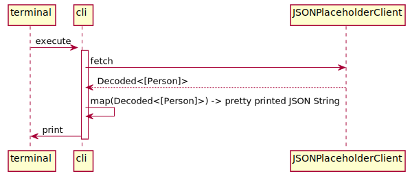

# cli

The `cli` project demonstrates how to use the shared networking client in a simple command line interface tool.

---

## Running

To run the project:

``` bash
cd cli
swift run
```

Running this should return data with the following structure:

``` json
{
  "value" : [
    {
      "id" : 8,
      "name" : "Nicholas Runolfsdottir V",
      "website" : "jacynthe.com"
    }
  ],
  "raw" : [
    {
      "phone" : "1-770-736-8031 x56442",
      "website" : "hildegard.org",
      "address" : {
        "city" : "Gwenborough",
        "street" : "Kulas Light",
        "suite" : "Apt. 556",
        "zipcode" : "92998-3874",
        "geo" : {
          "lat" : "-37.3159",
          "lng" : "81.1496"
        }
      },
      "id" : 1,
      "company" : {
        "name" : "Romaguera-Crona",
        "catchPhrase" : "Multi-layered client-server neural-net",
        "bs" : "harness real-time e-markets"
      },
      "email" : "Sincere@april.biz",
      "username" : "Bret",
      "name" : "Leanne Graham"
    }
  ],
  "errors" : [
    "Invalid website 'hildegard.org' found at [_JSONKey(stringValue: \"Index 0\", intValue: 0)]."
  ]
}
```

## Why

Having a way to execute our networking/parsing code outside of our main project is really useful.

We could for example write a `jq` query to pull out just the items that did not parse correctly, allowing us to do more in depth analysis:

``` bash
➜ .build/debug/cli | jq '(.value | map(.id)) as $valid_ids | .raw[] | select(.id | IN($valid_ids[]) | not) | {id, name, website}'
```

The output of running this command would return results like:

``` json
{
  "id": 1,
  "name": "Leanne Graham",
  "website": "hildegard.org"
}
{
  "id": 2,
  "name": "Ervin Howell",
  "website": "anastasia.net"
}
{
  "id": 3,
  "name": "Clementine Bauch",
  "website": "ramiro.info"
}
{
  "id": 4,
  "name": "Patricia Lebsack",
  "website": "kale.biz"
}
{
  "id": 5,
  "name": "Chelsey Dietrich",
  "website": "demarco.info"
}
{
  "id": 6,
  "name": "Mrs. Dennis Schulist",
  "website": "ola.org"
}
{
  "id": 7,
  "name": "Kurtis Weissnat",
  "website": "elvis.io"
}
{
  "id": 10,
  "name": "Clementina DuBuque",
  "website": "ambrose.net"
}
```

---

## Flow



This sample application uses the networking client to request people.
The bulk of the implementation is handling errors correctly and preparing the response to be pretty printed back out to the console.
