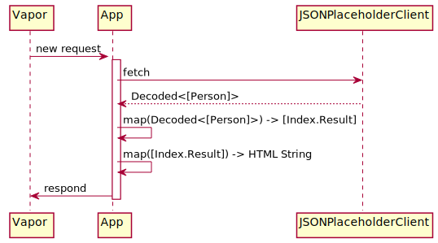

# Web

The `web` project demonstrates how to use the shared networking client in a simple Vapor application.

---

## Running

To run the project:

- Ensure you have Vapor installed - instructions are [here][1]

``` bash
cd web
vapor xcode
```

- Open the Xcode project and hit run.

Running the project and opening your favourite browser at "http://localhost:8080" should yield a beautiful webpage like this:


---

## Why

Without having to load our production app in a debugger we are able to inspect how the app would be interacting with the backend.
This is really powerful as it can reduce the debugging effort and allow people without specific expertise in iOS to potentially debug issues.

The ability to output the data to a different environment may also drive the way you model data.
For example I created the `Decoded` type specifically because this setup allowed me to.
Before I had this second front end my normal approach would be to discard the errors that occur during parsing, which makes things much more time consuming to debug.

---

## Flow



This sample application uses the networking client to request people.
This async request is converted to a Vapor promise.
To fulfil the promise the `[Person]` instance is mapped to a HTML string.

[1]: https://docs.vapor.codes/2.0/getting-started/install-on-macos/
